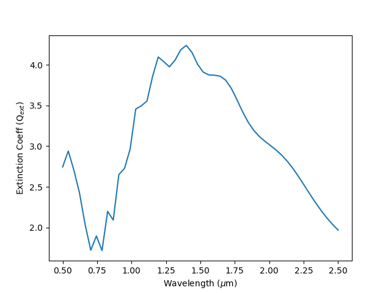

Basic Usage of :code:`dust_mie`
================================

Single Particle Size Evaluation
~~~~~~~~~~~~~~~~~~~~~~~~~~~~~~~~~~

Here is how to evaluate the Mie coefficients for Quartz at 1.0 microns with a particle size of 0.5 microns.

.. literalinclude:: snippets/basic_eval.py

..   :language: python

Or, here's how to show the extinction as a function of wavelength:

.. literalinclude:: snippets/plot_qext.py

..   :language: python

Particle Size Distribution Evaluation
~~~~~~~~~~~~~~~~~~~~~~~~~~~~~~~~~~~~~~

You can also calculate the extinction function for a log-normal particle size distribution.
Here, the sigma of the distribution is set to be 0.5

.. literalinclude:: snippets/plot_qext_distribution.py

..   :language: python

